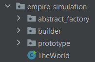
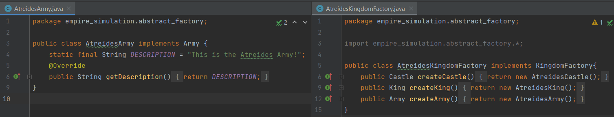
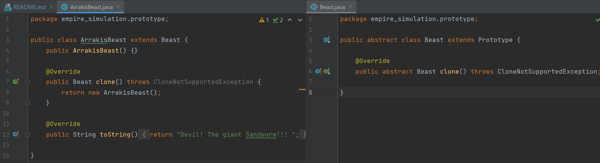
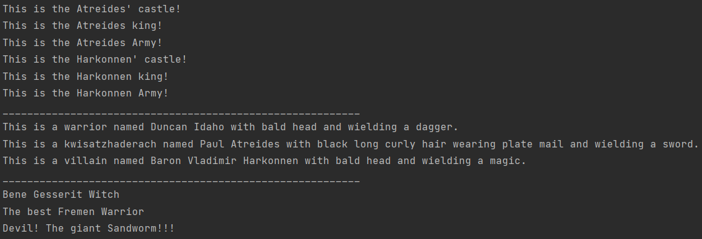

# Creational Design Patterns
This is a repository for creational design patterns project
### Author: Ana Sarapova

### Objectives:
* Get familiar with the Creational Design Patterns;
* Choose a specific domain;
* Implement at least 3 Creational Design Patterns for the specific domain;

### Implemented Patterns:
* Abstract Factory
* Builder
* Prototype

**Abstract Factory** is used when your code needs to work with various families of related products, but you don’t want it to depend on the concrete classes of those products—they might be unknown beforehand, or you simply want to allow for future extensibility.

**Builder** helps us to deal with flexible objects and simplifies their shaping at runtime.

**Prototype** is useful when creation of a new instance of a class is costly, using a cloning technique to which can be more efficient when used in the right circumstances and can save a lot of resources.

### Implementation
 The project is divided in 3 packages that implement each type of design pattern and the main file `TheWorld`.


 
As a reference for the project theme, was used the `Dune` movie.

The **Abstract Factory** implements the concept of the world with 2 main Houses, which have their Army, Castle and King. Each class implements an interface, which are used in creating the `KingdomFactory` - an abstract factory that makes a family of related objects.


The **Builder** creates the heroes of the story. It was build a static nested class `Hero` with the builder class created in it. The builder class has a public constructor with all the required attributes.
```python
       /**
         * Constructor
         */
        public Builder(Profession profession, String name) {
            if (profession == null || name == null) {
                throw new IllegalArgumentException("profession and name can not be null");
            }
            this.profession = profession;
            this.name = name;
        }

        public Builder withHairType(HairType hairType) {
            this.hairType = hairType;
            return this;
        }

        public Builder withHairColor(HairColor hairColor) {
            this.hairColor = hairColor;
            return this;
        }

        public Builder withArmor(Armor armor) {
            this.armor = armor;
            return this;
        }

        public Builder withWeapon(Weapon weapon) {
            this.weapon = weapon;
            return this;
        }

        public Hero build() {
            return new Hero(this);
        }
    }
   ```

The **Prototype** populates the world with other numerous characters. It declares the interface for cloning itself.


### Conclusion
In software engineering, creational design patterns are design patterns that deal with object creation mechanisms, trying to create objects in a manner suitable to the situation, that can be seen in the Output of the program. For each pattern were created several objects which validate de idea and implementation.

