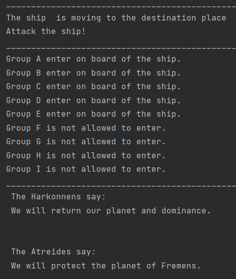

# Structural Design Patterns
This is a repository for structural design patterns project.
### Author: Ana Sarapova

### Objectives:
* Get familiar with the Structural Design Patterns;
* Implement at least 3 Structural Design Patterns for the specific domain;

### Implemented Patterns:
* Adapter
* Proxy
* Composite

**Adapter** helps two incompatible interfaces to work together by converting
the interface of one class into an interface expected by the clients.

**Proxy** provides a substitute or placeholder for another object.
A proxy controls access to the original object,
allowing you to perform something either before or after the request gets through to the original object.

**Composite** composes objects into tree structures and then work with these structures as if they were individual objects.

### Implementation
The project is divided in 3 packages that implement each type of design pattern and the main file `TheWorld`.

The **adapter** `BattleTransportShip` converts interface of the adaptee class `TransportShip` into a suitable `ship` expected by the client `DragonFly`.
For this case the `TransportShip` is reused adding the characteristics of the `DragonFLy` ship which can `attack` and `transport`.

```python
    public class BattleTransportShip  implements DragonFly{

    private TransportShip ship;

    public BattleTransportShip(){
        ship = new TransportShip();
    }

    @Override
    public void attack(){
        System.out.println("Attack the ship!");
    }

    @Override
    public void transport(){
        ship.move();
    }
}
```

The implemented **proxy** `FlyingShipProxy` controls access to the actual object `FlyingShip`.
```python
    public class FlyingShip {

    public void onBoard(People people){
        System.out.println( people + " enter on board of the ship.");
    }
}
______________________________________________________________________

    public class FlyingShipProxy extends FlyingShip{

    private static  final int NUM_PEOPLE_ALLOWED = 5;
    private int numPeople;

    @Override
    public void onBoard(People people){
        if (numPeople < NUM_PEOPLE_ALLOWED){
            super.onBoard(people);
            numPeople++;
        } else {
            System.out.println( people + " is not allowed to enter.");
        }
    }
}
```

And the **composite** pattern is used in installing the communication between Atreides and Harkonnen houses by introducing `LetterComposite` abstraction.
In this case `letters` compose `words`, and `words` compose `sentences`.
```python
    public abstract class LetterComposite {

    private List<LetterComposite> letterComposites = new ArrayList<>();

    public void add (LetterComposite letter) {
        letterComposites.add(letter);
    }

    public int count(){
        return letterComposites.size();
    }

    protected abstract void printBefore();
    protected abstract void printAfter();

    public void print(){
        printBefore();
        for (LetterComposite letter : letterComposites){
            letter.print();
        }
        printAfter();
    }
}
```
### Conclusion
Structural design patterns are great in explaining how to assemble objects and classes into larger structures
while keeping these structures flexible and efficient. The advantage of this type of patterns is the design 
by identifying a simple way to realize relationships between entities. The Output of the project can be seen below.
