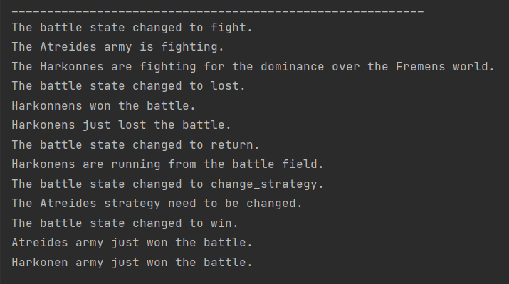

# Behavioral Design Patterns
This is a repository for behavioral design patterns project.
### Author: Ana Sarapova

### Objectives:
* Get familiar with the Behavioral Design Patterns;
* Implement at least 1 Behavioral Design Patterns for the specific domain;

### Implemented Patterns:
* Observer

**Observer** is a behavioral design pattern that lets you define a subscription
mechanism to notify multiple objects about any events that happen 
to the object they’re observing.

### Implementation
The Battles class has a state that can be observed. The Atreides and Harkonnens
register as observers and receive notifications when the Battles state changes.
The Battles state can be observed by implementing interface and registering as listener.
```
public interface BattleObserver {
    void update(BattleState battleState);
}
```
```
public class Battles {

    private BattleState currentState;
    private List<BattleObserver> observers;

    public Battles() {
        observers = new ArrayList<>();
        currentState = BattleState.NO_ENEMY;
    }

    public void addObserver(BattleObserver observer) {
        observers.add(observer);
    }

    public void removeObserver(BattleState observer) {
        observers.remove(observer);
    }

    public void timePasses() {
        BattleState[] enumValues = BattleState.values();
        currentState = enumValues[(currentState.ordinal() + 1) % enumValues.length];
        System.out.println("The battle state changed to " + currentState + ".");
        notifyObservers();
    }

    private void notifyObservers() {
        for (BattleObserver observer : observers) {
            observer.update(currentState);
        }
    }
```

### Conclusion
Observer design pattern is great in solving one-to-many dependency
between objects should be defined without making the objects tightly coupled.
The output of the program can be seen bellow.
